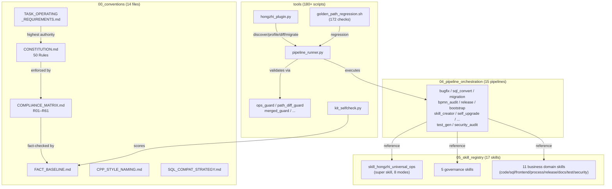

# beyond-dev-ai-kit

Repository for `prompt-dsl-system` governance pipelines and the `hongzhi-ai-kit` plugin runner package.

Language:

- English: `README.md`
- 中文: `README.zh-CN.md`
- Agent rules (EN): `AGENTS.md`
- Agent rules (中文): `AGENTS.zh-CN.md`
- Quick Start: `prompt-dsl-system/QUICKSTART.md`
- Exit Codes: `prompt-dsl-system/EXIT_CODES.md`
- Multi-Agent Adapter: `prompt-dsl-system/AGENTS_ADAPTER.md`

## Architecture



## Install (editable)

```bash
python3 -m pip install --upgrade pip setuptools wheel
python3 -m pip install -e .
```

## Entrypoints

- `python3 -m hongzhi_ai_kit --help`
- `hongzhi-ai-kit --help`
- `hzkit --help`
- `hz --help`

## Runtime Output Policy

- Runtime outputs under `prompt-dsl-system/tools` are generated artifacts and are intentionally **not versioned**.
- Typical files: `run_plan.yaml`, `validate_report.json`, `health_report.*`, `trace_index.*`, `guard_report.json`, `followup_*`.
- Historical docs and static snapshots are archived under `prompt-dsl-system/tools/history/**`.

## Natural Language Pipeline Routing

Route Chinese/English natural-language goals to the best-fit pipeline:

```bash
./prompt-dsl-system/tools/run.sh intent -r . --goal "修复 ownercommittee 模块状态流转问题，最小改动"
```

`intent` now supports both pipeline routing and command routing (`validate`/`selfcheck`/`self-upgrade`/`agent-audit`/`list`), and returns:

- `selected.action_kind`
- `selected.target`
- `selected.default_module_path` (only for governance/meta pipelines)
- `module_path_source` (`cli|goal|selected_default|missing`)
- `can_auto_execute`
- `routing_time_ms`

Routing behavior (generic-first + kit self-upgrade exception):

- The router scans available pipelines and reports top candidates.
- By default it falls back to the generic adaptive pipeline.
- For `beyond-dev-ai-kit` self-evolution goals explicitly targeting `prompt/DSL/skill/pipeline` upgrades, it prioritizes `pipeline_kit_self_upgrade.md`.
- Explicit pipeline mention has higher priority than command keyword matches.
- Business pipelines do not auto-fill `-m`; governance/meta pipelines can default to `prompt-dsl-system`.

Route and execute directly (when module path is known):

```bash
./prompt-dsl-system/tools/run.sh intent \
  -r . \
  --module-path /abs/path/to/module \
  --goal "将 Oracle SQL 迁移到 DM8，并输出回滚方案" \
  --execute

# kit self-upgrade route
./prompt-dsl-system/tools/run.sh intent \
  -r . \
  --module-path prompt-dsl-system \
  --goal "改进 beyond-dev-ai-kit 的 prompt/DSL/skill/pipeline 套件并落地" \
  --execute
```

If execute is blocked by low confidence or ambiguity, clarify goal first or use explicit override:

```bash
./prompt-dsl-system/tools/run.sh intent -r . --goal "..." --execute --force-execute
```

Intent router pressure test (deterministic, CI-friendly):

```bash
/usr/bin/python3 prompt-dsl-system/tools/tests/intent_router/intent_router_pressure.py --repo-root . --single-calls 6000 --concurrent-calls 8000 --concurrency 32
```

## Stack KB Bootstrap

Build per-project technical stack knowledge base (declared + discovered):

```bash
/usr/bin/python3 prompt-dsl-system/tools/project_stack_scanner.py \
  --repo-root /abs/path/to/target-project \
  --project-key xywygl \
  --kit-root .
```

## Kit Selfcheck

Run quality scorecard before major toolkit upgrades:

```bash
/usr/bin/python3 prompt-dsl-system/tools/kit_selfcheck.py --repo-root .
# or via wrapper
./prompt-dsl-system/tools/run.sh selfcheck -r .
# run unified self-upgrade pipeline
./prompt-dsl-system/tools/run.sh self-upgrade -r .
# strict self-upgrade preflight (recommended for major upgrades)
./prompt-dsl-system/tools/run.sh self-upgrade -r . --strict-self-upgrade
# optional: run agent capability audit directly
./prompt-dsl-system/tools/run.sh agent-audit -r . --single-calls 12000 --concurrent-calls 16000 --concurrency 48 --max-p99-ms 12
# optional: enforce selfcheck quality thresholds directly
/usr/bin/python3 prompt-dsl-system/tools/kit_selfcheck_gate.py --report-json prompt-dsl-system/tools/kit_selfcheck_report.json
# optional: enforce freshness/report-head consistency directly
/usr/bin/python3 prompt-dsl-system/tools/kit_selfcheck_freshness_gate.py --report-json prompt-dsl-system/tools/kit_selfcheck_report.json --repo-root .
# optional: verify kit integrity baseline
/usr/bin/python3 prompt-dsl-system/tools/kit_integrity_guard.py verify --repo-root . --manifest prompt-dsl-system/tools/kit_integrity_manifest.json
# optional: verify pipeline trust whitelist baseline
/usr/bin/python3 prompt-dsl-system/tools/pipeline_trust_guard.py verify --repo-root . --pipeline prompt-dsl-system/04_ai_pipeline_orchestration/pipeline_kit_self_upgrade.md --whitelist prompt-dsl-system/tools/pipeline_trust_whitelist.json
# optional: enforce hmac signature on baseline files
HONGZHI_BASELINE_REQUIRE_HMAC=1 HONGZHI_BASELINE_SIGN_KEY='<secret>' /usr/bin/python3 prompt-dsl-system/tools/kit_integrity_guard.py verify --repo-root . --manifest prompt-dsl-system/tools/kit_integrity_manifest.json
# optional: enable dual-approval mode for baseline changes
HONGZHI_BASELINE_DUAL_APPROVAL=1 ./prompt-dsl-system/tools/run.sh self-upgrade -r . --strict-self-upgrade
# optional: run hmac strict smoke gate
/usr/bin/python3 prompt-dsl-system/tools/hmac_strict_smoke.py --repo-root .
# optional: run parser/contract fuzz gate
/usr/bin/python3 prompt-dsl-system/tools/fuzz_contract_pipeline_gate.py --repo-root . --iterations 400
# optional: run governance consistency guard
/usr/bin/python3 prompt-dsl-system/tools/governance_consistency_guard.py --repo-root .
# optional: run tool syntax guard
/usr/bin/python3 prompt-dsl-system/tools/tool_syntax_guard.py --repo-root .
# optional: run pipeline trust full-coverage guard
/usr/bin/python3 prompt-dsl-system/tools/pipeline_trust_coverage_guard.py --repo-root .
# optional: run baseline provenance attestation guard
/usr/bin/python3 prompt-dsl-system/tools/baseline_provenance_guard.py verify --repo-root . --provenance prompt-dsl-system/tools/baseline_provenance.json
# optional: run mutation resilience guard
/usr/bin/python3 prompt-dsl-system/tools/gate_mutation_guard.py --repo-root .
# optional: run performance budget guard
/usr/bin/python3 prompt-dsl-system/tools/performance_budget_guard.py --repo-root .
# optional: enforce performance trend regression gate
/usr/bin/python3 prompt-dsl-system/tools/performance_budget_guard.py --repo-root . --trend-enforce true
# optional: validate README/FACT key facts against source-of-truth
/usr/bin/python3 prompt-dsl-system/tools/docs_facts_guard.py --repo-root .
# optional: ensure all deployed skills are pipeline-referenced
/usr/bin/python3 prompt-dsl-system/tools/deployed_skill_ref_guard.py --repo-root .
# optional: ensure runtime outputs are not tracked by git
/usr/bin/python3 prompt-dsl-system/tools/runtime_outputs_tracking_guard.py --repo-root .
# optional: ensure validate/selfcheck double-run does not add tracked diff
/usr/bin/python3 prompt-dsl-system/tools/double_run_consistency_guard.py --repo-root .
# replay machine-contract samples
bash prompt-dsl-system/tools/contract_samples/replay_contract_samples.sh --repo-root .
# optional: isolate + clean regression tmp while keeping report artifact
bash prompt-dsl-system/tools/golden_path_regression.sh \
  --repo-root . \
  --tmp-dir _regression_tmp_local \
  --report-out prompt-dsl-system/tools/regression_report.latest.md \
  --clean-tmp
# optional: execute a single shard (all|early|mid|late)
bash prompt-dsl-system/tools/golden_path_regression.sh --repo-root . --shard-group late --clean-tmp
# optional: one-shot release readiness chain
make release-check
```

`golden_path_regression.sh` now performs signal-safe cleanup (`INT/TERM/EXIT`): it restores `skills.json` and removes injected regression skill directories on interruption.

Detailed plugin contract and governance rules: `prompt-dsl-system/tools/PLUGIN_RUNNER.md`.

CI mandatory gates are defined in `.github/workflows/kit_guardrails.yml` and enforce baseline-rebuild strict order + baseline-diff dual approval proof + hmac smoke + fuzz gate + governance consistency + tool syntax + pipeline trust coverage + baseline provenance + mutation resilience + performance budget + docs facts guard + deployed skill reference guard + runtime outputs tracking guard + `validate` + double-run consistency guard + `golden_path_regression` shard matrix (`early|mid|late`). CI uploads per-shard reports, merges shard summary, and hard-fails when shard summary contract is broken (missing report / non-pass shard / count mismatch).
